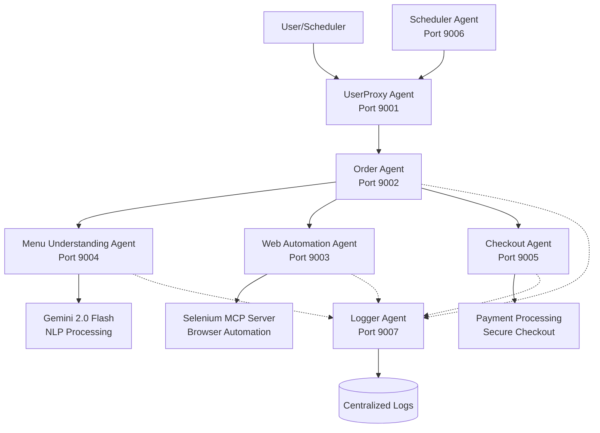

# McDonald's A2A Ordering System
How I Built an AI Agent to Order McDonald's for Me Every Wednesday
This project is an Agent-to-Agent (A2A) ordering system for McDonald's, designed to automate the ordering process using various specialized agents.

https://medium.com/@adriensieg/how-i-built-an-ai-agent-to-order-mcdonalds-for-me-every-wednesday-2814fabb17f7

## Personal Opinion Disclaimer
The views and opinions expressed are **my own and do not reflect the official policy or position of my employer (McDonald's).**

**Automating interactions with websites, especially those involving user accounts and transactions, can raise ethical and legal concerns. Always ensure that your automation activities comply with the terms of service of the website and relevant laws. Additionally, consider the ethical implications of automating tasks that interact with user data and privacy.**

This project is provided solely for **illustrative purposes** to facilitate a deeper understanding of **agent-based systems**. It is intended strictly for **testing** and **educational use** only and shall not be employed for any commercial or production purposes.

## Why should we care about AI Agents? Isn't this just another tech buzz?

Actually, no - this feels like a real turning point.

**AI mode is changing everything**. **Google isn't just a search engine anymore**; it's evolving into something totally different. Instead of **showing you a list of links**, it's now generating these AI-crafted "mini-websites" right on the results page, built instantly to answer your question. So guess what? **Fewer people are clicking through to your actual site**. **They're getting what they need straight from an AI's version of your content.**

That's a big deal. It means we need to rethink how we create and structure our content. It's no longer just about keywords and SEO - **it's about making your content understandable to large language models**. That's where MCPs come in (Model-Consumable Pages). These are built so **AI agents can easily digest and use your data without loading your full site**.

Is this the future of the web? Honestly, I think it could be. Time will tell, but I'm feeling pretty hopeful.

Take something like mcdonalds.com or ubereats.com - **people might not visit it directly anymore**. Instead, the AI **just pulls what it needs from the site and gives users the answers**. **No clicks, no pageviews - just machine-to-machine interaction.**

ChatGPT is officially clocking more site visits than Wikipedia in the US - https://sherwood.news/tech/chatgpt-is-officially-clocking-more-site-visits-than-wikipedia-in-the-us/


In the US - OpenAI’s chatbot has now overtaken the free online encyclopedia
https://www.michelegargiulo.com/blog/chatgpt-surpasses-wikipedia-traffic

## The Solution
The system will start and initialize all agents. You can place a manual order by calling the process_user_order method with a string input, such as:

```python
result = await orchestrator.process_user_order("Get me something spicy for lunch")
print(f"Order result: {result}")
```
The system is also set up to automatically place orders every Wednesday at noon.

## Project Structure
```
/mcdonalds_a2a_ordering_system
│
├── /src
│   ├── __init__.py
│   ├── main.py
│   ├── agents
│   │   ├── __init__.py
│   │   ├── base_agent.py
│   │   ├── user_proxy_agent.py
│   │   ├── order_agent.py
│   │   ├── web_automation_agent.py
│   │   ├── menu_understanding_agent.py
│   │   ├── checkout_agent.py
│   │   ├── scheduler_agent.py
│   │   └── logger_agent.py
│   ├── orchestrator.py
│   └── a2a
│       ├── __init__.py
│       └── types.py
├── requirements.txt
└── README.md
```

## Create a virtual environment:

```
python -m venv venv
source venv/bin/activate  # On Windows use `venv\Scripts\activate`
```

## Requirements

**requirements.txt**
```
google-genai
google-adk
asyncio
```

```
pip install -r requirements.txt
```

# Explanations

## Modular Code Breakdown
- **Base Agent** (`base_agent.py`): Contains the BaseA2AAgent class, which is the base class for all agents.
- **User Proxy Agent** (`user_proxy_agent.py`): Contains the UserProxyAgent class.
- **Order Agent** (`order_agent.py`): Contains the OrderAgent class
- **Web Automation Agent** (`web_automation_agent.py`):Contains the WebAutomationAgent class.
- **Menu Understanding Agent** (`menu_understanding_agent.py`): Contains the MenuUnderstandingAgent class.
- **Checkout Agent** (`checkout_agent.py`): Contains the CheckoutAgent class.
- **Scheduler Agent** (`scheduler_agent.py`): Contains the SchedulerAgent class.
- **Logger Agent** (`logger_agent.py`): Contains the LoggerAgent class.

- **Orchestrator** (`orchestrator.py`): Contains the McDonaldsA2AOrchestrator class.
- **Main Script** (`main.py`): Contains the main function to run the system.

## The Architecture

```mermaid
sequenceDiagram
    participant User
    participant UserProxy as UserProxy Agent
    participant OrderAgent as Order Agent
    participant MenuAgent as Menu Understanding Agent
    participant WebAgent as Web Automation Agent
    participant CheckoutAgent as Checkout Agent
    participant LoggerAgent as Logger Agent
    participant SchedulerAgent as Scheduler Agent
    participant MCP as MCP Server
    participant Selenium as Selenium WebDriver
    participant Gemini as Gemini 2.0 Flash
    participant UberEats as UberEats Website
    participant Payment as Payment Gateway

    Note over User, Payment: McDonald's A2A Ordering System - Wednesday Lunch Automation

    %% Scheduled Trigger
    rect rgb(40, 40, 60)
        Note over SchedulerAgent: Wednesday 12:00 PM Detection
        SchedulerAgent->>SchedulerAgent: Check current time & weekday
        SchedulerAgent->>UserProxy: Trigger weekly order
        Note right of SchedulerAgent: Subtask: Schedule Management
    end

    %% User Input Processing
    rect rgb(60, 40, 40)
        Note over User, UserProxy: 1. User initiates high-level task
        User->>UserProxy: "Order my usual Wednesday special"
        UserProxy->>LoggerAgent: Log user request
        Note right of UserProxy: Assign task (e.g., McDonald's Order)
    end

    %% Discovery and Delegation
    rect rgb(40, 60, 40)
        Note over UserProxy, OrderAgent: 2. Discovery and Delegation
        UserProxy->>OrderAgent: Forward order request
        OrderAgent->>MCP: Discover Agent Cards (skills, tools)
        MCP-->>OrderAgent: Available Agents & Tools
        Note right of OrderAgent: OrderAgent delegates subtasks
    end

    %% Menu Understanding Subtask
    rect rgb(60, 60, 40)
        Note over OrderAgent, MenuAgent: Subtask: Parse Menu Intent
        OrderAgent->>MenuAgent: Parse user input: "usual Wednesday special"
        MenuAgent->>Gemini: Process natural language request
        Note right of MenuAgent: MenuAgent uses Gemini for NLP
        
        Gemini->>Gemini: Analyze: "usual" + "Wednesday" + "special"
        Gemini-->>MenuAgent: Parsed intent & menu items
        Note right of Gemini: Intent: Global Menu Items
        
        MenuAgent->>MenuAgent: Map to specific items
        MenuAgent-->>OrderAgent: Structured menu selection
        Note left of MenuAgent: Items: Spicy Nuggets, Pistachio McFlurry, Loaded Fries
    end

    %% Web Automation Subtask
    rect rgb(60, 40, 60)
        Note over OrderAgent, WebAgent: Subtask: Web Automation
        OrderAgent->>WebAgent: Execute order placement
        WebAgent->>MCP: Request Selenium tools
        MCP-->>WebAgent: Selenium toolset & capabilities
        Note right of WebAgent: WebAgent uses MCP tools
        
        WebAgent->>Selenium: Initialize browser session
        Note right of WebAgent: Use Tool: Browser Launch
        Selenium-->>WebAgent: Browser ready
        
        WebAgent->>UberEats: Navigate to UberEats.com
        Note right of WebAgent: Use Tool: Navigation
        UberEats-->>WebAgent: Homepage loaded
        
        WebAgent->>UberEats: Search "McDonald's Global Menu Chicago"
        Note right of WebAgent: Use Tool: Search & Select
        UberEats-->>WebAgent: Restaurant options
        
        WebAgent->>UberEats: Select McDonald's Global Menu location
        UberEats-->>WebAgent: Menu page loaded
        
        WebAgent->>UberEats: Add Spicy Black Garlic McNuggets
        Note right of WebAgent: Use Tool: Add to Cart
        UberEats-->>WebAgent: Item added confirmation
        
        WebAgent->>UberEats: Add Pistachio McFlurry
        UberEats-->>WebAgent: Item added confirmation
        
        WebAgent->>UberEats: Add Cheese & Bacon Loaded Fries
        UberEats-->>WebAgent: Item added confirmation
        
        WebAgent->>UberEats: Navigate to cart
        Note right of WebAgent: Use Tool: Cart Navigation
        UberEats-->>WebAgent: Cart contents displayed
        
        WebAgent-->>OrderAgent: Cart ready for checkout
        Note left of WebAgent: Status: Ready for payment
    end

    %% Budget Validation Subtask
    rect rgb(40, 60, 60)
        Note over OrderAgent, CheckoutAgent: Subtask: Validate Budget & Checkout
        OrderAgent->>CheckoutAgent: Initiate secure checkout
        CheckoutAgent->>CheckoutAgent: Calculate total cost
        Note right of CheckoutAgent: CheckoutAgent uses calculator
        
        CheckoutAgent->>CheckoutAgent: Validate against weekly budget
        Note right of CheckoutAgent: Budget check: $15.00 limit
        CheckoutAgent->>CheckoutAgent: Verify delivery address
        Note right of CheckoutAgent: Address: Chicago location
    end

    %% Payment Processing
    rect rgb(60, 60, 60)
        Note over CheckoutAgent, Payment: Secure Payment Processing
        CheckoutAgent->>UberEats: Login with stored credentials
        UberEats-->>CheckoutAgent: Authentication success
        
        CheckoutAgent->>UberEats: Confirm delivery address
        UberEats-->>CheckoutAgent: Address verified
        
        CheckoutAgent->>Payment: Process payment method
        Note right of CheckoutAgent: Secure payment handling
        Payment-->>CheckoutAgent: Payment authorized
        
        CheckoutAgent->>UberEats: Complete order placement
        UberEats-->>CheckoutAgent: Order confirmation & tracking
        Note left of CheckoutAgent: Order ID: MC_20250608_120045
    end

    %% Results Aggregation
    rect rgb(40, 40, 40)
        Note over OrderAgent, LoggerAgent: Return results to OrderAgent
        CheckoutAgent-->>OrderAgent: Order completed successfully
        Note left of CheckoutAgent: Order Details & ETA
        
        OrderAgent->>LoggerAgent: Log successful order
        Note right of OrderAgent: Analytics: Success rate, timing
        
        OrderAgent->>OrderAgent: Aggregate all results
        Note right of OrderAgent: Final Composition
    end

    %% Final Output
    rect rgb(60, 40, 40)
        Note over OrderAgent, User: Validate & Format Output
        OrderAgent->>OrderAgent: Structure response
        Note right of OrderAgent: Structured Response
        
        OrderAgent-->>UserProxy: Complete order summary
        UserProxy-->>User: Order confirmation & tracking
        Note left of UserProxy: Final Order Status (Structured)
        
        LoggerAgent->>LoggerAgent: Update success metrics
        Note right of LoggerAgent: Weekly statistics updated
    end

    %% Background Monitoring
    rect rgb(30, 30, 30)
        Note over LoggerAgent: Continuous System Monitoring
        LoggerAgent->>LoggerAgent: Track agent performance
        LoggerAgent->>LoggerAgent: Monitor error rates
        LoggerAgent->>LoggerAgent: Generate analytics dashboard
    end
```




# Bibliography
- `OVERALL`: **Introducing Agent2Agent (A2A): Understanding Google’s Protocol for AI Collaboration** > https://priyalwalpita.medium.com/introducing-agent2agent-a2a-understanding-googles-protocol-for-ai-collaboration-10a46155c458
- `OVERALL`: **Agent2Agent: A practical guide to build agents** > https://composio.dev/blog/agent2agent-a-practical-guide-to-build-agents/
- `OVERALL`: **Inside Google’s Agent2Agent (A2A) Protocol: Teaching AI Agents to Talk to Each Other** > https://towardsdatascience.com/inside-googles-agent2agent-a2a-protocol-teaching-ai-agents-to-talk-to-each-other/
- `SECURITY`: **Secure A2A Authentication with Auth0 and Google Cloud** > https://auth0.com/blog/auth0-google-a2a/
- `SECURITY`: **The future of AI agents—and why OAuth must evolve** > https://techcommunity.microsoft.com/blog/microsoft-entra-blog/the-future-of-ai-agents%E2%80%94and-why-oauth-must-evolve/3827391
- `SECURITY`: **Google A2A protocol authentication methods explained: Securing AI agent communication** > https://www.byteplus.com/en/topic/551189?title=google-a2a-protocol-authentication-methods-explained-securing-ai-agent-communication
- `SECURITY`: **Google A2A protocol OAuth authentication: A complete guide** > https://www.byteplus.com/en/topic/551471?title=google-a2a-protocol-oauth-authentication-a-complete-guide
- `SECURITY`: **Google A2A protocol authentication methods explained: Securing AI agent communication** > https://www.byteplus.com/en/topic/551189?title=google-a2a-protocol-authentication-methods-explained-securing-ai-agent-communication
- `SECURITY`: **Delegated User Authorization for Agent2Agent Servers** > https://github.com/google-a2a/A2A/issues/19
- `SECURITY`: **Threat Modeling Google's A2A Protocol with the MAESTRO Framework** > https://cloudsecurityalliance.org/blog/2025/04/30/threat-modeling-google-s-a2a-protocol-with-the-maestro-framework
- `SECURITY`: **Security Analysis: Potential AI Agent Hijacking via MCP and A2A Protocol Insights** > https://medium.com/@foraisec/security-analysis-potential-ai-agent-hijacking-via-mcp-and-a2a-protocol-insights-cd1ec5e6045f
- `SECURITY`: **Deep Dive MCP and A2A Attack Vectors for AI Agents** > https://www.solo.io/blog/deep-dive-mcp-and-a2a-attack-vectors-for-ai-agents
- `SECURITY`: **OAuth 2.0 and  OpenID Connect: The Professional Guide** > https://assets.ctfassets.net/2ntc334xpx65/7D1vaJ4Q908Th0iklEkFWs/d4a6ebeb2814000214da88a224c9b2f4/OAuth_2.0_and_OpenID_Connect__The_Professional_Guide_Feb6.pdf
- `PREDICTION`: **I Stopped Building Frontends. Now I Use MCP Servers to Let AI Run My Apps** > https://medium.com/javascript-in-plain-english/i-stopped-building-frontends-now-i-use-mcp-servers-to-let-ai-run-my-apps-178b0d7107ca
