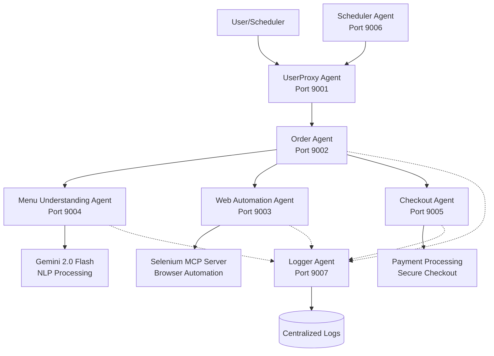

# AI-Agents-McDonalds
How I Built an AI Agent to Order McDonald's for Me Every Wednesday

```mermaid
graph TB
    User[User/Scheduler] --> UserProxy[UserProxy Agent<br/>Port 9001]
    UserProxy --> OrderAgent[Order Agent<br/>Port 9002]
    
    OrderAgent --> MenuAgent[Menu Understanding Agent<br/>Port 9004]
    OrderAgent --> WebAgent[Web Automation Agent<br/>Port 9003]
    OrderAgent --> CheckoutAgent[Checkout Agent<br/>Port 9005]
    
    WebAgent --> Selenium[Selenium MCP Server<br/>Browser Automation]
    MenuAgent --> Gemini[Gemini 2.0 Flash<br/>NLP Processing]
    CheckoutAgent --> PaymentAPI[Payment Processing<br/>Secure Checkout]
    
    SchedulerAgent[Scheduler Agent<br/>Port 9006] --> UserProxy
    LoggerAgent[Logger Agent<br/>Port 9007] --> Database[(Centralized Logs)]
    
    OrderAgent -.-> LoggerAgent
    WebAgent -.-> LoggerAgent
    MenuAgent -.-> LoggerAgent
    CheckoutAgent -.-> LoggerAgent
```
