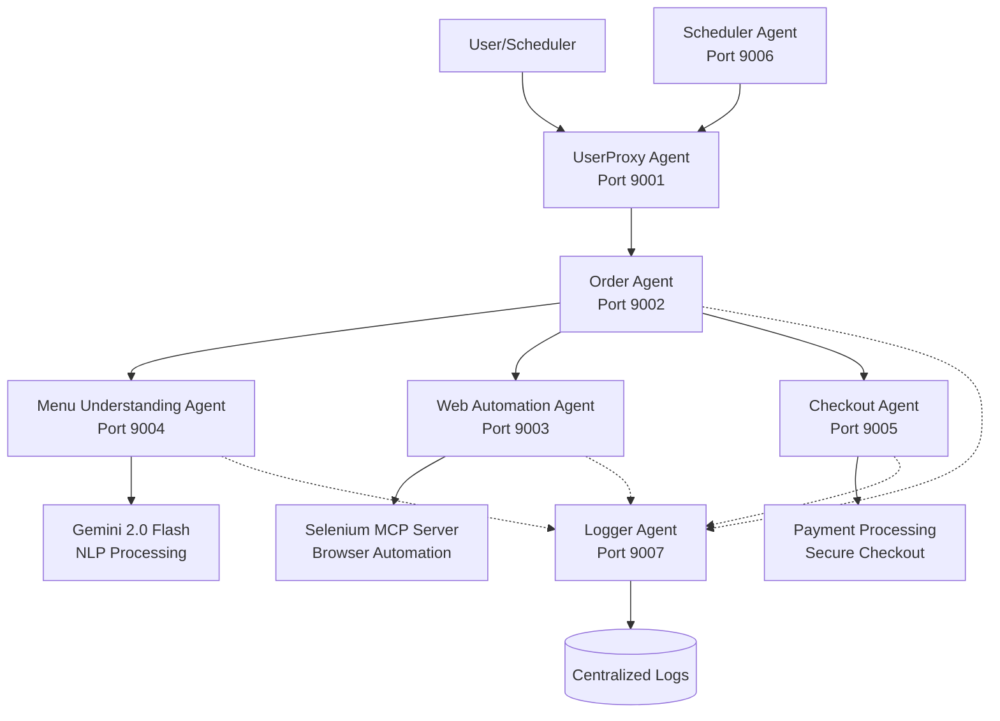

# McDonald's A2A Ordering System
How I Built an AI Agent to Order McDonald's for Me Every Wednesday
This project is an Agent-to-Agent (A2A) ordering system for McDonald's, designed to automate the ordering process using various specialized agents.

## Project Structure
```
/mcdonalds_a2a_ordering_system
│
├── /src
│   ├── __init__.py
│   ├── main.py
│   ├── agents
│   │   ├── __init__.py
│   │   ├── base_agent.py
│   │   ├── user_proxy_agent.py
│   │   ├── order_agent.py
│   │   ├── web_automation_agent.py
│   │   ├── menu_understanding_agent.py
│   │   ├── checkout_agent.py
│   │   ├── scheduler_agent.py
│   │   └── logger_agent.py
│   ├── orchestrator.py
│   └── a2a
│       ├── __init__.py
│       └── types.py
├── requirements.txt
└── README.md
```

## Create a virtual environment:

```
python -m venv venv
source venv/bin/activate  # On Windows use `venv\Scripts\activate`
```

## Requirements

**requirements.txt**
```
google-genai
google-adk
asyncio
```

```
pip install -r requirements.txt
```

# Explanations

## Modular Code Breakdown
- **Base Agent** (`base_agent.py`): Contains the BaseA2AAgent class, which is the base class for all agents.

## The Architecture

```mermaid
sequenceDiagram
    participant User
    participant UserProxy as UserProxy Agent
    participant OrderAgent as Order Agent
    participant MenuAgent as Menu Understanding Agent
    participant WebAgent as Web Automation Agent
    participant CheckoutAgent as Checkout Agent
    participant LoggerAgent as Logger Agent
    participant SchedulerAgent as Scheduler Agent
    participant MCP as MCP Server
    participant Selenium as Selenium WebDriver
    participant Gemini as Gemini 2.0 Flash
    participant UberEats as UberEats Website
    participant Payment as Payment Gateway

    Note over User, Payment: McDonald's A2A Ordering System - Wednesday Lunch Automation

    %% Scheduled Trigger
    rect rgb(40, 40, 60)
        Note over SchedulerAgent: Wednesday 12:00 PM Detection
        SchedulerAgent->>SchedulerAgent: Check current time & weekday
        SchedulerAgent->>UserProxy: Trigger weekly order
        Note right of SchedulerAgent: Subtask: Schedule Management
    end

    %% User Input Processing
    rect rgb(60, 40, 40)
        Note over User, UserProxy: 1. User initiates high-level task
        User->>UserProxy: "Order my usual Wednesday special"
        UserProxy->>LoggerAgent: Log user request
        Note right of UserProxy: Assign task (e.g., McDonald's Order)
    end

    %% Discovery and Delegation
    rect rgb(40, 60, 40)
        Note over UserProxy, OrderAgent: 2. Discovery and Delegation
        UserProxy->>OrderAgent: Forward order request
        OrderAgent->>MCP: Discover Agent Cards (skills, tools)
        MCP-->>OrderAgent: Available Agents & Tools
        Note right of OrderAgent: OrderAgent delegates subtasks
    end

    %% Menu Understanding Subtask
    rect rgb(60, 60, 40)
        Note over OrderAgent, MenuAgent: Subtask: Parse Menu Intent
        OrderAgent->>MenuAgent: Parse user input: "usual Wednesday special"
        MenuAgent->>Gemini: Process natural language request
        Note right of MenuAgent: MenuAgent uses Gemini for NLP
        
        Gemini->>Gemini: Analyze: "usual" + "Wednesday" + "special"
        Gemini-->>MenuAgent: Parsed intent & menu items
        Note right of Gemini: Intent: Global Menu Items
        
        MenuAgent->>MenuAgent: Map to specific items
        MenuAgent-->>OrderAgent: Structured menu selection
        Note left of MenuAgent: Items: Spicy Nuggets, Pistachio McFlurry, Loaded Fries
    end

    %% Web Automation Subtask
    rect rgb(60, 40, 60)
        Note over OrderAgent, WebAgent: Subtask: Web Automation
        OrderAgent->>WebAgent: Execute order placement
        WebAgent->>MCP: Request Selenium tools
        MCP-->>WebAgent: Selenium toolset & capabilities
        Note right of WebAgent: WebAgent uses MCP tools
        
        WebAgent->>Selenium: Initialize browser session
        Note right of WebAgent: Use Tool: Browser Launch
        Selenium-->>WebAgent: Browser ready
        
        WebAgent->>UberEats: Navigate to UberEats.com
        Note right of WebAgent: Use Tool: Navigation
        UberEats-->>WebAgent: Homepage loaded
        
        WebAgent->>UberEats: Search "McDonald's Global Menu Chicago"
        Note right of WebAgent: Use Tool: Search & Select
        UberEats-->>WebAgent: Restaurant options
        
        WebAgent->>UberEats: Select McDonald's Global Menu location
        UberEats-->>WebAgent: Menu page loaded
        
        WebAgent->>UberEats: Add Spicy Black Garlic McNuggets
        Note right of WebAgent: Use Tool: Add to Cart
        UberEats-->>WebAgent: Item added confirmation
        
        WebAgent->>UberEats: Add Pistachio McFlurry
        UberEats-->>WebAgent: Item added confirmation
        
        WebAgent->>UberEats: Add Cheese & Bacon Loaded Fries
        UberEats-->>WebAgent: Item added confirmation
        
        WebAgent->>UberEats: Navigate to cart
        Note right of WebAgent: Use Tool: Cart Navigation
        UberEats-->>WebAgent: Cart contents displayed
        
        WebAgent-->>OrderAgent: Cart ready for checkout
        Note left of WebAgent: Status: Ready for payment
    end

    %% Budget Validation Subtask
    rect rgb(40, 60, 60)
        Note over OrderAgent, CheckoutAgent: Subtask: Validate Budget & Checkout
        OrderAgent->>CheckoutAgent: Initiate secure checkout
        CheckoutAgent->>CheckoutAgent: Calculate total cost
        Note right of CheckoutAgent: CheckoutAgent uses calculator
        
        CheckoutAgent->>CheckoutAgent: Validate against weekly budget
        Note right of CheckoutAgent: Budget check: $15.00 limit
        CheckoutAgent->>CheckoutAgent: Verify delivery address
        Note right of CheckoutAgent: Address: Chicago location
    end

    %% Payment Processing
    rect rgb(60, 60, 60)
        Note over CheckoutAgent, Payment: Secure Payment Processing
        CheckoutAgent->>UberEats: Login with stored credentials
        UberEats-->>CheckoutAgent: Authentication success
        
        CheckoutAgent->>UberEats: Confirm delivery address
        UberEats-->>CheckoutAgent: Address verified
        
        CheckoutAgent->>Payment: Process payment method
        Note right of CheckoutAgent: Secure payment handling
        Payment-->>CheckoutAgent: Payment authorized
        
        CheckoutAgent->>UberEats: Complete order placement
        UberEats-->>CheckoutAgent: Order confirmation & tracking
        Note left of CheckoutAgent: Order ID: MC_20250608_120045
    end

    %% Results Aggregation
    rect rgb(40, 40, 40)
        Note over OrderAgent, LoggerAgent: Return results to OrderAgent
        CheckoutAgent-->>OrderAgent: Order completed successfully
        Note left of CheckoutAgent: Order Details & ETA
        
        OrderAgent->>LoggerAgent: Log successful order
        Note right of OrderAgent: Analytics: Success rate, timing
        
        OrderAgent->>OrderAgent: Aggregate all results
        Note right of OrderAgent: Final Composition
    end

    %% Final Output
    rect rgb(60, 40, 40)
        Note over OrderAgent, User: Validate & Format Output
        OrderAgent->>OrderAgent: Structure response
        Note right of OrderAgent: Structured Response
        
        OrderAgent-->>UserProxy: Complete order summary
        UserProxy-->>User: Order confirmation & tracking
        Note left of UserProxy: Final Order Status (Structured)
        
        LoggerAgent->>LoggerAgent: Update success metrics
        Note right of LoggerAgent: Weekly statistics updated
    end

    %% Background Monitoring
    rect rgb(30, 30, 30)
        Note over LoggerAgent: Continuous System Monitoring
        LoggerAgent->>LoggerAgent: Track agent performance
        LoggerAgent->>LoggerAgent: Monitor error rates
        LoggerAgent->>LoggerAgent: Generate analytics dashboard
    end
```



